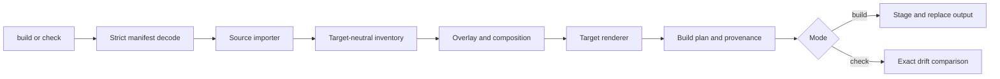

# Architecture

**Agent Bundler** is a small compiler with explicit boundaries:



## Pipeline

1. **CLI** discovers the manifest, parses selectors, maps diagnostics, and
   chooses `build` or `check`.
2. **Model validation** decodes strict UTF-8 JSON and rejects unknown fields,
   duplicate keys, invalid paths, invalid targets, and malformed patch shapes.
   Source importers share root-containment and no-symlink checks for workspace
   paths; text parsers reject malformed UTF-8 before string conversion.
3. **Source importers** read one of `skills-repository`, `bundle`, or
   `claude-plugin` and normalize packages, typed hooks, executable-aware payload
   files, metadata, capabilities, and native gaps.
4. **Composition** clones each selected package for a target, applies overlays
   and preambles, checks capability acknowledgments, and resolves native-gap
   policy without translating vendor event names.
5. **Target renderers** consume an explicit render input: ordered packages,
   distribution metadata, and separate/aggregate package mode. Target leaves own
   native manifests, event mappings, root syntax, catalogs, and safe native-check
   declarations. Renderers return a target-relative `BuildPlan` and do not write
   files.
6. **Artifact handling** adds provenance, stages output for `build`, compares
   the plan against existing files for read-only `check`, and invokes declared
   native validators only for `check --native` after drift passes.

## Package ownership

- `cmd/agbun`: CLI flags, manifest discovery, output channels, and
  exit statuses.
- `internal/compiler/model`: manifest, source inventory, overlay, composition,
  and validation types.
- `internal/compiler/source`: importers for the three source kinds and
  normalization.
- `internal/compiler/composition`: overlays, preambles, capabilities,
  acknowledgments, and native gaps.
- `internal/target`: target adapters and target-relative build plans.
- `internal/target/packageoutput`: shared package-root, payload, and collision
  mechanics. Target leaves own package, agent, hook, and catalog serialization.
- `internal/target/marketplace`: pure validation and deterministic ordering of
  common catalog entries; it has no publication, filesystem, process, clock,
  Git, or network behavior.
- `internal/target/pi/runtime`: dependency-free TypeScript hook runtime owned by
  the Pi adapter. Go embeds the reviewed source bytes and emits one thin adapter
  for an explicit aggregate package.
- `internal/artifact/write`: staging and complete output replacement.
- `internal/artifact/compare`: exact output drift detection.
- `internal/artifact/provenance`: configuration, input, output, and
  acknowledgment metadata.
- `internal/artifact/nativeverify`: declared native checks, when adapters
  provide them.

## Determinism and ownership

The compiler normalizes and sorts input, assets, hooks, files, packages,
catalog entries, targets, and output paths. Build output may depend on source
bytes, explicit manifests, target revisions, and embedded Pi runtime bytes. It
does not depend on network state, wall clock, hostname, locale, Git state,
installed vendor versions, or absolute source paths. The provenance file records
hashes so a later `check` can identify drift.

`build` owns the complete configured output directory. It writes through a
staging/journal path and replaces the output only after the plan is ready.
`check` does not mutate output.

## Adding a target

A target adapter defines:

- target ID and output root;
- package codec for installable manifest and agent serialization;
- capability defaults;
- native-gap defaults;
- target-relative renderer behavior;
- optional native verification checks.

Keep source import and target rendering separate. A target-specific difference
that belongs to one skill should be an overlay; a rule that applies to every
asset for a target belongs in composition. Do not make a renderer silently drop
an asset it cannot represent; classify it and fail or resolve it explicitly.

## Architecture drift checks

`.archfit.yaml` makes the intended dependency direction executable:

```text
compiler model → stage implementations → compiler orchestrator → CLI
```

The composition, source, target, and artifact stages may depend on the shared
model but not on one another. They meet in `internal/compiler`. Archfit also
gates import cycles, inward-to-outward layer inversions, and imports that bypass
a module's declared public package.

Enable the tracked pre-push hook once per clone:

```sh
scripts/setup-git-hooks
```

Run the deterministic gate directly, or let the enabled pre-push hook run it:

```sh
scripts/check-architecture
```

For a full local report using the configured SCIP, syntax, and clone analyzers:

```sh
archfit analyze --config .archfit.yaml --refresh
```

For an off-gate LLM summary, load an API key into the local environment and add
`--ai-summary`. Do not commit `.env` or use the LLM summary as a CI decision:

```sh
set -a
. /path/to/private/archfit/.env
set +a
archfit analyze --config .archfit.yaml --refresh --ai-summary
```

CI installs Archfit v1.6.0 and pinned SCIP, ast-grep, and jscpd analyzers, then
runs the deterministic gate in strict tool mode. It also runs Go tests/race/vet,
Go lint, the pinned Bun TypeScript gate, the six-target deterministic fixture,
and checksum/version-pinned Claude and Grok validators. Local pre-push uses the
same architecture config and requires its analyzers, but local tool versions may
differ. The pre-push hook fails closed if Archfit or a required analyzer is
missing. Update versions, config, CI pins, and validator evidence together; run
`archfit doctor` after an upgrade.

A green gate proves only the declared boundaries under available analyzer
coverage. Review the human report and architecture intent when adding a module
or changing package responsibilities.

## Current boundary

The portable contract covers command hooks with typed event, matcher, arguments,
timeout, async, failure-policy, order, decision capabilities, payload bytes, and
executable intent. HTTP, prompt-handler, agent-handler, and MCP-tool-handler
hooks remain outside it. Target-native resources remain explicit gaps.

Pi's runtime is the only generated runtime shim. It stays cohesive inside the Pi
adapter, scans no global package roots, and loads only the generated descriptor
passed by its thin adapter. All other vendor mappings stay in their target
leaves. Catalog generation is local metadata only; installation, publication,
authentication, and network fetching stay outside the compiler.

After hook or target-contract changes, the scoped human re-review covers
`internal/compiler/model`, `internal/compiler/source`,
`internal/compiler/composition`, `internal/target`,
`internal/target/pi/runtime`, and `internal/artifact`. Trace bundle/Claude import
through composition, rendering, Pi embedding, artifact write/check, and native
verification; re-check target-neutral semantics, dependency direction, runtime
ownership, capability truthfulness, and D1–D14 from the implementation plan.

For user-facing behavior, see [targets and CLI](targets-and-cli.md). For the
input contract, see [configuration](configuration.md).
