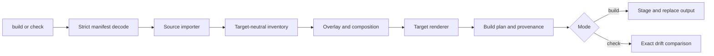

# Architecture

**Agent Bundler** is a small compiler with explicit boundaries:



## Pipeline

1. **CLI** discovers the manifest, parses selectors, maps diagnostics, and
   chooses `build` or `check`.
2. **Model validation** decodes strict JSON and rejects unknown fields,
   duplicate keys, invalid paths, invalid targets, and malformed patch shapes.
3. **Source importers** read one of `skills-repository`, `bundle`, or
   `claude-plugin` and normalize packages, assets, metadata, frontmatter, body,
   support files, capabilities, and native gaps.
4. **Composition** clones each selected package for a target, applies overlays
   and preambles, checks capability acknowledgments, and resolves native-gap
   policy.
5. **Target renderers** turn normalized packages into a target-relative
   distribution `BuildPlan`. Installable profiles keep package roots separate;
   project profiles retain their target-specific package contract. Renderers do
   not write files.
6. **Artifact handling** adds provenance, stages output for `build`, or compares
   the plan against existing files for `check`.

## Package ownership

- `cmd/agbun`: CLI flags, manifest discovery, output channels, and
  exit statuses.
- `internal/compiler/model`: manifest, source inventory, overlay, composition,
  and validation types.
- `internal/compiler/source`: importers for the three source kinds and
  normalization.
- `internal/compiler/composition`: overlays, preambles, capabilities,
  acknowledgments, and native gaps.
- `internal/target`: target adapters and target-relative build plans.
- `internal/artifact/write`: staging and complete output replacement.
- `internal/artifact/compare`: exact output drift detection.
- `internal/artifact/provenance`: configuration, input, output, and
  acknowledgment metadata.
- `internal/artifact/nativeverify`: declared native checks, when adapters
  provide them.

## Determinism and ownership

The compiler normalizes and sorts input, assets, files, targets, and output paths.
Build output does not depend on network state, wall clock, hostname, locale, or
absolute source paths. The provenance file records hashes so a later `check`
can identify drift.

`build` owns the complete configured output directory. It writes through a
staging/journal path and replaces the output only after the plan is ready.
`check` does not mutate output.

## Adding a target

A target adapter defines:

- target ID and output root;
- capability defaults;
- native-gap defaults;
- target-relative renderer behavior;
- optional native verification checks.

Keep source import and target rendering separate. A target-specific difference
that belongs to one skill should be an overlay; a rule that applies to every
asset for a target belongs in composition. Do not make a renderer silently drop
an asset it cannot represent; classify it and fail or resolve it explicitly.

## Architecture drift checks

`.archfit.yaml` makes the intended dependency direction executable:

```text
compiler model → stage implementations → compiler orchestrator → CLI
```

The composition, source, target, and artifact stages may depend on the shared
model but not on one another. They meet in `internal/compiler`. Archfit also
gates import cycles, inward-to-outward layer inversions, and imports that bypass
a module's declared public package.

Enable the tracked pre-push hook once per clone:

```sh
scripts/setup-git-hooks
```

Run the deterministic gate directly, or let the enabled pre-push hook run it:

```sh
scripts/check-architecture
```

For a full local report using the configured SCIP, syntax, and clone analyzers:

```sh
archfit analyze --config .archfit.yaml --refresh
```

For an off-gate LLM summary, load an API key into the local environment and add
`--ai-summary`. Do not commit `.env` or use the LLM summary as a CI decision:

```sh
set -a
. /path/to/private/archfit/.env
set +a
archfit analyze --config .archfit.yaml --refresh --ai-summary
```

CI installs Archfit v1.6.0 and pinned SCIP, ast-grep, and jscpd analyzers, then
runs the deterministic gate in strict tool mode. Local pre-push uses the same
config and requires those analyzers, but local tool versions may differ. The
pre-push hook fails closed if Archfit or a required analyzer is missing. Update
the version, config, and CI tool pins together; run `archfit doctor` after an
upgrade.

A green gate proves only the declared boundaries under available analyzer
coverage. Review the human report and architecture intent when adding a module
or changing package responsibilities.

## Current boundary

Project renderers accept one package containing skills. Installable package
profiles additionally render portable resources, supported native agent forms,
and multiple self-contained package roots. The source model is deliberately
broader so richer assets and native gaps can be imported, validated, and reported,
but hooks, scripts, and target-native resources still need target-specific
rendering contracts.

For user-facing behavior, see [targets and CLI](targets-and-cli.md). For the
input contract, see [configuration](configuration.md).
