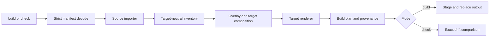

# Agentbundler Guide

Agentbundler keeps one portable skill source and renders it into the directory
layout expected by several coding agents. It is a compiler, not an installer:
it reads a strict manifest, imports source files, applies target-specific
customization, renders a complete target tree, and either writes or verifies
that tree.

```text
portable source + agentbundle.json
              │
              ▼
       import → compose → render
              │
              ├── generated/claude/.claude/skills/…
              ├── generated/codex/.codex-plugin/…
              ├── generated/pi/.pi/skills/…
              ├── generated/copilot/.github/skills/…
              ├── generated/grok/.grok/skills/…
              └── generated/cursor/.cursor-plugin/…
```

Use Agentbundler when the same skill should be shared across coding agents but
needs small, deliberate differences per agent. Keep the source and manifest in
version control. Treat the generated directory as disposable build output.

## Install

```sh
brew install alexei-led/tap/agentbundler
```

Alternative for Go users:

```sh
go install github.com/alexei-led/agentbundler/cmd/agentbundler@latest
```

From a source checkout:

```sh
go run ./cmd/agentbundler --help
```

## Quick start

This is the smallest useful source: one skill and one support file.

```text
project/
├── agentbundle.json
├── source/
│   └── skills/
│       └── explain-query/
│           ├── SKILL.md
│           └── references.md
└── generated/                 # created by agentbundler
```

`source/skills/explain-query/SKILL.md`:

```md
---
{ "name": "explain-query", "description": "Explain SQL queries clearly" }
---

# Explain a query

Explain what a query does, then identify correctness and performance risks.

## Examples

Use a small query and explain it line by line.
```

`agentbundle.json`:

```json
{
  "version": 1,
  "kind": "skills-repository",
  "root": "source",
  "targets": ["claude", "codex", "pi", "copilot", "grok", "cursor"],
  "output": "generated",
  "skillsRepository": {
    "package": "team-skills",
    "roots": ["skills"],
    "metadata": {
      "description": "Team coding skills",
      "version": "1.0.0",
      "homepage": "https://example.com/team-skills"
    }
  }
}
```

Run from `project/`:

```sh
agentbundler build
agentbundler check
```

Expected result:

```text
build: ok
check: current
```

The generated tree is:

```text
generated/
├── .agentbundler/build.json
├── claude/.claude/skills/explain-query/
│   ├── SKILL.md
│   └── references.md
├── codex/
│   ├── .codex-plugin/plugin.json
│   └── skills/explain-query/{SKILL.md,references.md}
├── pi/.pi/skills/explain-query/{SKILL.md,references.md}
├── copilot/.github/skills/explain-query/{SKILL.md,references.md}
├── grok/.grok/skills/explain-query/{SKILL.md,references.md}
└── cursor/
    ├── .cursor-plugin/plugin.json
    └── skills/explain-query/{SKILL.md,references.md}
```

`generated/<target>/` is a target-ready tree. For example, copy or link the
contents of `generated/pi/` into a project to use the generated `.pi/skills`
directory. Do not aim `output` at a working project root or merge it blindly
with hand-written agent configuration: `build` replaces the complete configured
output directory. Keep generated output separate and make deployment/collision
handling explicit in your repository workflow.

## How the compiler works

1. **Decode.** Read `agentbundle.json`. Unknown fields, duplicate JSON keys,
   invalid paths, and invalid target names fail early.
2. **Import.** Read one source kind and normalize skills, metadata, Markdown
   frontmatter, bodies, and support files into a target-neutral model.
3. **Compose.** Apply a target overlay, then target composition policy. An
   overlay changes one asset. Composition controls target-wide preambles,
   capability rules, and native-gap handling.
4. **Render.** Convert the normalized package into the selected agent's native
   directory layout. Current renderers support one package containing skills.
5. **Write or compare.** `build` stages and replaces output. `check` compares
   the expected plan with existing output and reports drift. Both modes write no
   network state and are deterministic.
6. **Record provenance.** `.agentbundler/build.json` records the configuration
   digest, input/output hashes, acknowledgments, and output file details.

The generated output is compiler-owned. A hand-written file in `generated/`
will be reported as extra by `check` and removed by `build`.

## Source formats

Choose one `kind` in the manifest.

### `skills-repository`: the usual choice

Use this when a directory already contains skill folders. Each declared root is
scanned recursively for `SKILL.md`. The directory containing that file is the
skill name; every other regular file below it becomes a support file.

```json
{
  "version": 1,
  "kind": "skills-repository",
  "root": "source",
  "targets": ["pi"],
  "output": "generated",
  "skillsRepository": {
    "package": "team-skills",
    "roots": ["skills"],
    "metadata": {}
  }
}
```

Per-skill sidecars are centralized below the source root:

```text
source/
├── skills/explain-query/SKILL.md
└── .agentbundler/
    └── assets/
        └── skill/
            └── explain-query/
                └── targets/
                    └── pi.json
```

### `bundle`: explicit package membership

Use this when one repository contains several named packages or when you need
an explicit asset list. The manifest lists package JSON files; package `assets`
entries are exact paths, not globs.

```text
bundle/
├── packages/team.json
└── src/
    └── skills/explain-query/
        └── SKILL.md
```

```json
{
  "version": 1,
  "kind": "bundle",
  "root": "bundle",
  "targets": ["pi"],
  "output": "generated",
  "bundle": { "packages": ["packages/team.json"] }
}
```

```json
{
  "id": "team-skills",
  "metadata": {},
  "assets": ["src/skills/explain-query"]
}
```

Bundle sidecars live beside the asset:

```text
bundle/src/skills/explain-query/
├── SKILL.md
└── .agentbundler/
    ├── asset.json
    └── targets/pi.json
```

`asset.json` declares capability uses. The target sidecar contains the
frontmatter, body, and file changes described below. Bundle package membership
is explicit, so an unlisted skill is ignored.

A bundle can contain multiple packages, but the current skill renderers render
one package at a time. Select it with `--package team-skills`.

### `claude-plugin`: import a Claude plugin

Use this to migrate an existing Claude plugin. The plugin must contain
`.claude-plugin/plugin.json`; skills below `skills/` are imported, and direct
agents/hooks are recognized during import. The current target renderers still
render skills only, so imported agents, hooks, and native resources require
explicit policy and do not become generated files automatically.

```json
{
  "version": 1,
  "kind": "claude-plugin",
  "root": "source",
  "targets": ["claude", "pi"],
  "output": "generated",
  "claudePlugin": { "pluginRoot": "plugin" }
}
```

Plugin sidecars are centralized inside the plugin:

```text
source/plugin/
├── .claude-plugin/plugin.json
├── skills/explain-query/SKILL.md
└── .agentbundler/assets/skill/explain-query/targets/pi.json
```

Unrecognized regular files in a Claude plugin are treated as Claude native
resources, not copied as portable support files. Keep plugin examples limited
to recognized skills unless you also configure their native gaps.

## Target differences

Agentbundler emits the skill subset in each agent's native location. The
runtime documentation explains what each agent discovers and how it extends
itself; Agentbundler does not install the agent, register a plugin, or enable an
extension.

| Target         | Generated location                                |
| -------------- | ------------------------------------------------- |
| Claude Code    | `.claude/skills/<name>/`                          |
| Codex          | `.codex-plugin/plugin.json` and `skills/<name>/`  |
| Pi             | `.pi/skills/<name>/`                              |
| GitHub Copilot | `.github/skills/<name>/`                          |
| Grok Build     | `.grok/skills/<name>/`                            |
| Cursor         | `.cursor-plugin/plugin.json` and `skills/<name>/` |

Target-specific differences:

- **Claude Code** discovers project skills from `.claude/skills`. Claude
  plugins can also contain agents, hooks, and MCP servers; this compiler emits
  only skills.
- **Codex** gets a generated plugin manifest with the package name and
  `./skills`. String metadata such as description and version is included when
  present.
- **Pi** discovers `SKILL.md` folders recursively and can also load packages
  containing skills, extensions, prompts, and themes. Agentbundler emits skills,
  not TypeScript extensions or a Pi package manifest.
- **GitHub Copilot** uses the open Agent Skills folder format. Custom agents
  are outside the current skill renderer.
- **Grok Build** discovers skills from `.grok/skills` and enabled plugins.
  Agentbundler emits the project skill folder, not a Grok plugin or marketplace
  entry.
- **Cursor** gets a generated plugin manifest with `./skills/` and supported
  string metadata such as display name, homepage, repository, license, and
  publisher.

The generated `SKILL.md` keeps the skill body and support files. When
frontmatter is present, Agentbundler writes it between `---` lines as a compact
JSON object. This is the source format accepted by Agentbundler; it is not a
promise that every agent supports every possible frontmatter key. An emitted
path is also not proof of end-to-end vendor support: verify the runtime behavior
against the target's documentation above.

Read the runtime documentation before adding target-specific features. These
links were checked on 2026-07-13; agent runtimes change independently of
Agentbundler releases:

- [Claude Code plugins](https://code.claude.com/docs/en/plugins) and
  [skills](https://code.claude.com/docs/en/skills)
- [Codex skills](https://developers.openai.com/codex/skills)
- [Pi skills](https://github.com/earendil-works/pi/blob/main/packages/coding-agent/docs/skills.md),
  [packages](https://github.com/earendil-works/pi/blob/main/packages/coding-agent/docs/packages.md),
  and [extensions](https://github.com/earendil-works/pi/blob/main/packages/coding-agent/docs/extensions.md)
- [GitHub Copilot agent skills](https://docs.github.com/copilot/concepts/agents/about-agent-skills)
- [Grok Build skills, plugins, and marketplaces](https://docs.x.ai/build/features/skills-plugins-marketplaces)
- [Cursor rules](https://docs.cursor.com/en/context/rules) and
  [Agent Skills release notes](https://cursor.com/changelog/2-4)
- [Agent Skills specification](https://agentskills.io/specification)

## Target-specific customization

There are two levels of customization:

- **Asset overlay:** change one skill for one target.
- **Target composition:** change the policy applied to all assets for one
  target, such as a preamble or capability/native-gap rules.

Overlays are target-scoped, not inherited. An asset can have at most one
overlay per target; there is no chain of overlays or implicit inheritance from
another target. The compiler applies changes in this order:

1. copy the canonical frontmatter, body, and support files;
2. apply the recursive `frontmatterPatch`;
3. delete `deletedFiles`;
4. replace/add `files`;
5. apply `bodyPatch`;
6. prepend the target-wide `skillPreamble`, if configured.

A target sidecar's filesystem `files/` tree wins over its JSON `files` entry at
the same path. This order makes a build reproducible and explains which change
wins when a target customization touches several parts of one skill.

### Frontmatter patches

Frontmatter must be a JSON object between the first two `---` lines. The patch
is recursive. An object merges into an object; a scalar, array, or object
replaces a non-object; `null` removes a key.

Base `SKILL.md`:

```md
---
{
  "name": "explain-query",
  "description": "Explain SQL queries",
  "metadata": { "audience": "all", "draft": false },
}
---

# Explain a query
```

`source/.agentbundler/assets/skill/explain-query/targets/pi.json`:

```json
{
  "frontmatterPatch": {
    "description": "Explain SQL queries with Pi conventions",
    "metadata": { "audience": "developers", "draft": null }
  }
}
```

The Pi output has the equivalent of:

```json
{
  "name": "explain-query",
  "description": "Explain SQL queries with Pi conventions",
  "metadata": { "audience": "developers" }
}
```

Frontmatter patches are data merges, not YAML or JSON-Pointer operations.

### Body replacement

Replace the entire body when the target needs a different document:

```json
{
  "bodyPatch": {
    "mode": "replace",
    "text": "# Explain a query\n\nUse Pi's shell and file tools.\n"
  }
}
```

### Markdown section replacement

Replace the body under an exact heading path while keeping the heading itself:

```json
{
  "bodyPatch": {
    "mode": "sections",
    "sections": [
      {
        "headingPath": ["Examples", "PostgreSQL"],
        "body": "Use EXPLAIN ANALYZE for PostgreSQL examples.\n"
      }
    ]
  }
}
```

This is a heading-block replacement, not an arbitrary marker replacement.
Heading paths are hierarchical ATX headings (`#` through `######`). Fenced
code blocks are ignored. Setext headings are not recognized. The heading must
exist exactly once; missing, duplicate, or overlapping patches fail the build.

### Support-file replacement and deletion

Replace or add a support file with the JSON form:

```json
{
  "files": {
    "references.md": "Pi-specific reference text\n",
    "examples/query.sql": {
      "base64": "U0VMRUNUICogRlJSTyB0ZWFtXzsK"
    }
  },
  "deletedFiles": ["references/legacy.md"]
}
```

The paths are relative to the asset directory and cannot escape it. A file in
the target sidecar's sibling `files/` tree overrides a JSON `files` value at
the same path:

```text
.agentbundler/assets/skill/explain-query/targets/pi/
└── files/
    └── references.md       # wins over files.references.md
```

Deleting a missing support file is a no-op. A path cannot be both replaced and
deleted. Binary support files use the `{ "base64": "…" }` form.

### Target preambles

A target composition can prepend common text to every rendered skill body:

```json
{
  "composition": [
    {
      "target": "pi",
      "skillPreamble": "Use Pi tools and report commands first."
    }
  ]
}
```

The preamble is added after the asset body patch. It is useful for a short
runtime policy; use a body patch when only one skill or one section differs.

### Capabilities and native gaps

`composition` is also where source capabilities and target-native gaps are
classified. Capability states are `native`, `equivalent`, `advisory`, and
`unsupported`. An advisory capability needs an exact acknowledgment with an
asset, target, key, and reason. Unsupported capability use fails compilation.

A composition entry **replaces** the adapter's default rules; it does not merge
with them. If you declare a composition entry with capabilities, list every
capability rule needed by that target.

```json
{
  "composition": [
    {
      "target": "pi",
      "capabilities": [{ "key": "asset.skill", "state": "native" }],
      "nativeGaps": []
    }
  ]
}
```

Current built-in adapters classify skills as native and agents, hooks, and
native resources as unsupported. All current renderers accept one package of
skills only. Use native-gap policy only when you understand the source format
and target behavior; it does not make an unsupported asset renderable.

## Build, check, and select

```sh
# Build all manifest targets.
agentbundler build

# Check without writing.
agentbundler check

# Build one target.
agentbundler build --target pi

# Check one package and one target.
agentbundler check --target codex --package team-skills

# Machine-readable result.
agentbundler check --json
```

`--root` points to the directory containing `agentbundle.json`. Without it,
Agentbundler searches the current directory and its parents. `--target` and
`--package` may be repeated, but selections must be declared and unique.

Exit statuses:

- `0`: success; `check` found current output.
- `1`: source, validation, capability, render, or write failure.
- `2`: output drift: missing, changed, extra, non-regular, or symlinked output.
- `3`: native verification failure.

`--native` is valid only with `check`. It runs declared native checks after the
output is already current. Current built-in target adapters declare no native
checks, so `--native` currently adds no checks.

For automation, `--json` writes one result object to stdout. Diagnostics use
stderr. The result includes `version`, `command`, `diagnostics`, `drift`, and
`nativeVerificationFailed`.

## Limitations

Current renderers intentionally support a narrow, lossless subset:

- one package per target plan;
- `skill` assets and their support files;
- JSON-object frontmatter and Markdown bodies;
- target overlays for frontmatter, heading blocks, files, and deletions.

The following are not currently rendered:

- agent assets;
- hook assets;
- target-native resources;
- arbitrary custom capability uses;
- multi-package aggregation into one target output;
- full Claude, Pi, Codex, Grok, Copilot, or Cursor plugin/extension manifests
  beyond the generated Codex and Cursor skill manifests.

The compiler rejects source and sidecar symlinks, unsafe paths, malformed
frontmatter, ambiguous section anchors, overlapping body patches, duplicate
manifest keys, and unknown manifest fields. It does not silently drop a feature
that a target cannot represent.

## Architecture



- `cmd/agentbundler` owns manifest discovery, flags, output channels, and exit
  status.
- `internal/compiler/source` imports the three source kinds.
- `internal/compiler/composition` applies overlays, capability rules,
  acknowledgments, and native-gap policy.
- `internal/target` renders complete target plans without writing files.
- `internal/artifact` adds provenance, writes output, compares drift, and runs
  declared native checks.

The normal build uses no network, clock, Git state, hostname, locale, or
absolute source paths as output inputs.
