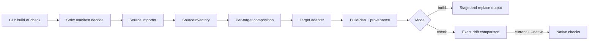

# Agentbundler Guide

Agentbundler reads `agentbundle.json`, imports one declared source layout, and
owns the configured generated-output directory.

## Install

Requires Go 1.26.

```sh
go install github.com/alexei-led/agentbundler/cmd/agentbundler@latest
```

From a source checkout, run without installing:

```sh
go run ./cmd/agentbundler --help
```

## First build

Start with a skills repository:

```text
project/
├── agentbundle.json
└── source/
    └── skills/
        └── explain-query/
            ├── SKILL.md
            └── references.md
```

`agentbundle.json`:

```json
{
  "version": 1,
  "kind": "skills-repository",
  "root": "source",
  "targets": ["claude", "pi"],
  "output": "generated",
  "skillsRepository": {
    "package": "team-skills",
    "roots": ["skills"],
    "metadata": {}
  }
}
```

Build and verify from `project/`:

```sh
agentbundler build
agentbundler check
```

The build produces:

```text
generated/
├── .agentbundler/build.json
├── claude/.claude/skills/explain-query/
│   ├── SKILL.md
│   └── references.md
└── pi/.pi/skills/explain-query/
    ├── SKILL.md
    └── references.md
```

Skill roots are scanned recursively for `SKILL.md`. The containing directory is
the skill name; other files below it are copied as support files. Frontmatter is
optional. When present, it must be a JSON object between `---` lines.

## Configuration

Manifest JSON rejects unknown fields and duplicate keys. Paths use normalized
forward slashes and must be relative to their documented anchor:

- `root` and source-specific paths are relative to the manifest directory or
  declared source root, as noted below.
- `output` is relative to the directory containing `agentbundle.json`.
- `targets` is a non-empty list of `claude`, `codex`, `pi`, `copilot`, `grok`, or
  `cursor`.
- `composition` is an optional list of per-target composition policies.
- `version` is schema version `1`.
- `kind` is `bundle`, `claude-plugin`, or `skills-repository`.

Exactly one source block must match `kind`:

- `skills-repository` requires `skillsRepository` with `package`, non-empty
  `roots`, and `metadata`. Its roots are relative to `root`.
- `claude-plugin` requires `claudePlugin.pluginRoot`, relative to `root`. The
  plugin must contain `.claude-plugin/plugin.json`.
- `bundle` requires `bundle.packages`, a non-empty list of package-manifest
  paths relative to `root`.

A `composition` entry has a `target` and may set `skillPreamble`, `capabilities`,
and `nativeGaps`. If a target has no entry, its adapter capability rules are
used. Advisory capabilities require explicit acknowledgments. Unsupported
capabilities fail compilation.

## Commands

```sh
agentbundler build
agentbundler check
```

- `--root` points to the directory containing `agentbundle.json`. Without it,
  Agentbundler searches the current directory and its parents.
- Repeat `--target` or `--package` to select a subset declared by the source.
- `--json` writes one versioned result object to standard output. Human
  diagnostics use standard error.
- `--native` is valid only for `check`. Native checks run only after generated
  output is current. Current target adapters declare no native checks, so the
  flag currently runs no extra commands.

Exit status:

- `0`: success; generated output is current for `check`.
- `1`: source, capability, render, or write failure.
- `2`: generated-output drift.
- `3`: native verification failure.

> The configured output directory is disposable and compiler-owned. `build`
> replaces the complete directory, including when selectors produce a partial
> plan. Keep no hand-written files there.

### Machine-readable drift check

```sh
agentbundler check --root . --json
```

The result contains `version`, `command`, `diagnostics`, `drift`, and
`nativeVerificationFailed`. The process still uses the exit statuses above.

## Target output

Paths below are relative to `<output>/<target>/`:

- Claude: `.claude/skills/<skill>/`
- Copilot: `.github/skills/<skill>/`
- Pi: `.pi/skills/<skill>/`
- Grok: `.grok/skills/<skill>/`
- Codex: `.codex-plugin/plugin.json` and `skills/<skill>/`
- Cursor: `.cursor-plugin/plugin.json` and `skills/<skill>/`

Every build also writes compiler provenance to
`<output>/.agentbundler/build.json`. It records a configuration digest, input
and output hashes, acknowledgments, and adapter revisions.

## Architecture



- `cmd/agentbundler` owns argument parsing, manifest discovery, output channels,
  and exit status.
- `internal/compiler/source` imports bundle, Claude-plugin, or
  skills-repository layouts into target-neutral packages.
- `internal/compiler/composition` applies overlays, capability rules,
  acknowledgments, and native-gap policy.
- `internal/target` renders complete target plans; adapters do not write files
  or run processes.
- `internal/artifact` validates plans, adds provenance, replaces output, detects
  drift, and runs declared native checks.

The pipeline is deterministic: normal compilation does not use network, clock,
Git state, hostname, locale, or absolute source paths as output inputs.
